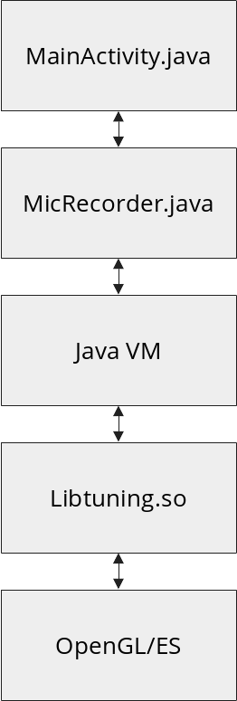

# Tuning
An application that finds the peak pitch of incoming audio.
Parts of the code can work on other platforms, namely, the
user interface, as it uses OpenGL, and FFTW3, which can be compiled
for any platform too. I've used the NanoVG library which allows you
to select an API backend at compile time.

## Building
You will need Android Studio, as well as a recent version of the Android
NDK. You will also need to get fftw-android, and set FFTW3_DIR in "app/src/main/cpp/CMakeLists.txt" to the directory where fftw-android is located. You can clone the repository from https://github.com/Lauszus/fftw3-android.

## Authors and Contributors
This application was made by me, Benjamin Cottrell.

## Acknowledgements
I would like to thank Jacob Waas, for his assistance in figuring out how to use FFTW's
routines for complex-based data.

